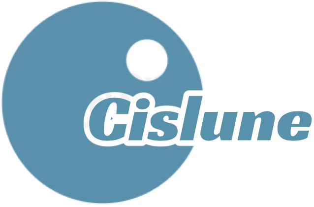

TODO:
1. Fix the launch files. All gazebo stuff should be in sim, all ROS2 Control in control, etc. Make it modular
    Done

2. Make groundstation and jetson setup scripts for things Docker can't do automatically
3. Make full setup scripts that do literally everything from computer setup to docker setup to launching program
4. Make subpackage readme's
5. Add support for remotely uploading to Teensy
6. Support all needed commands in rover_bringup
7. Fix the weird wheel drift
8. Write the xml for the control plugins
9. Write the task execution for waypoints

Lessons learned:
1. Don't name every ros2 package prepended with rover_ because it makes autocomplete hate you
2. I have no idea if it's best practice but I do really like separating the launch files into modules within
    their respective ROS2 

Okay actually pretty README starts now

# Cislune RE-RASSOR


This repository contains the codebase for Cislune's version of the Florida Space Institute's RE-RASSOR project. The codebase is custom, as well as some of the 3D parts. Full credits will be listed in the credits section.

- Software Stack
    - ROS2 (Jazzy)
    - ROS2 Control
    - Gazebo (Harmonic)
    - Nav2
    - Docker (Ubuntu Noble image)
    - PlatformIO
    - Mosh
- Hardware
    - Jetson Orin Nano Developer Kit
    - Teensy 4.1
    - Zed Mini

[]()

- [Introduction](#introduction)
- [Installation and Setup](#installation-and-setup)
- [Rover Bringup](#rover-bringup)
- [Editing Guide](#editing-guide)
- [About the Project](#about-the-project)
- [Learning Outcomes](#learning-outcomes)
- [Credits](#credits)

## Introduction

**This code was only ever intended to run on Ubuntu based Linux distributions. There is no support for macOS or Windows.** However, because most of this will run in Docker, it is might be possible to translate the Linux setup commands into the corresponding commands for Windows or macOS. There was no way for me to test this, so I did not include it in the instructions.

This project was designed to run primarily in a Docker instance to help with consistency and portability. If you would like to learn more about docker, you can do so at [Docker Overview](https://docs.docker.com/get-started/docker-overview/). Specifically, this project uses Docker Engine with buildx for multi-architecture support. Installation details are listed in Installation and Setup. This docker setup is designed to work on both ARM64,x86-64, Nvidia GPU's, and not Nvidia GPU's.

Additionally, this project was designed with the assumption that the rover is using a Jetson Orin Nano as the onboard rover computer, a Teensy 4.1 as the microcontroller connected to the Jetson over USB, and a groundstation computer that remotely ssh's into the Jetson to run commands and view through Rviz2.

Most of the downloads and installations for necessary libraries will be handled inside the Dockerfile and compose files. There are a few things that need to be downloaded directly on the Jetson and on the groundstation computer. All of this setup has been configured in bash scripts included in the scripts/ folder of the repository, and the Installation and Setup section will instruct you on what scripts to run on what device.

After all the installation and setup is done, you should only need to compose and connect the Docker container to develop and run the program. Bringup instructions, including all the different startup options, are explained in Rover Bringup.

This project was specifically designed to be modular. If you would like to edit this codebase for your own purposes and swap out some of the components, the guide to do so is in Editing Guide.

**If you are new to ROS2 projects and want to learn more**, I recommend two sources. Firstly, the beginning documentation for ROS2 is actually really good. It effectively teaches ROS2 concepts, though the quality does decrease as the complexity increases. You can find the ROS2 Jazzy documentation [here](https://docs.ros.org/en/jazzy/index.html). Secondly, I recommend using the official Nav2 documentation for everything else. It teaches concepts such as URDFs, transforms, and Gazebo. The official documentation for Gazebo is not very good and it is difficult to find updated tutorials, but Nav2 does a great job. You can find the official Nav2 documentation [here](https://docs.nav2.org/). [Articulated Robotics](https://articulatedrobotics.xyz/tutorials/) does a really good from scratch walkthrough as well, though it uses an outdated version of Gazebo that is not compatible with ROS2 Jazzy and up. It is difficult to find good tutorials for ROS2 Control that actually implement a Hardware Component, but you can find the official documentation [here](https://control.ros.org/master/doc/getting_started/getting_started.html). It does not have the best instructions so I recommend getting to this part last.

If you're curious about the background of the project, my learning outcomes as a student, or for the specific credits, those are all listed in the bottom sections.

## Installation and Setup

### Prerequisites
**Both the groundstation computer and the Jetson Orin Nano should be running Ubuntu 22.04 (Jammy Jellyfish) as their operating system.** While the Docker instance will be running Ubuntu 24.04 (Noble Numbat), there are compatibility issues between Nvidia's Jetpack SDK for Noble and Docker; the easiest solution is to downgrade the host computers.

### Necessary Downloads

Ensure that a recent version of [Git](https://git-scm.com/downloads/linux) and [VSCode](https://code.visualstudio.com/download) is downloaded.

Install Docker Engine and Docker Buildx by following the [Install using the apt repository](https://docs.docker.com/engine/install/ubuntu/#install-using-the-repository) tutorial from the official Docker documentation.

### Cloning the Repository

In the directory of your choice, either run the command `git clone https://github.com/TheThingKnownAsKit/Cislune-RE-RASSOR.git` to clone via https or run `git clone git@github.com:TheThingKnownAsKit/Cislune-RE-RASSOR.git` to clone via SSH.

Open this repository in VSCode and download the recommended extensions by clicking 'yes' to the prompt.

### Setting up Your Environment

Your personal .env file (that should be included in the .gitignore) requires 3 things to enable multi-arch support for Docker:
1. OWNER=your github username in plaintext
2. IMAGE=ros2:jazzy-dev
3. PAT=ghp_xxxxxxxxxxxx

The .env requires a ghp key in order to create the multi-arch image during the initial build process. To make a ghp key, sign into github and go to Settings -> Developer Settings -> Personal access tokens -> Tokens (classic). You can either generate a new token with write:packages enabled, or reuse an old one. Copy the full string, "ghp_xxxxxxxxxxxx" into PAT=

### Setup Scripts

For convenience, bash scripts have been written to do most of the setup for you. All of these commands are intended to be ran from the root of the repository.

Before anything else, <u>make sure your system is up to date</u> by running the following commands. Ensure that all packages are upgraded, though if you know for certain that a package will not interact with this repository's tech stack at all, you can ignore it.
```Bash
sudo apt update
sudo apt upgrade
sudo apt-get update
sudo apt-get upgrade
apt list --upgradable 
```

Now, you need to make all the scripts executable via chmod. Run the command `chmod +x scripts/*.sh` to make every bash script in the scripts/ folder executable.

To build the ghcr.io image that enables multi-arch support, run the command `./scripts/build_multiarch_ghcr.io_image.sh`. **You only need to do this once, ever, per GitHub user. Even if you rebuild the Docker image from the groundup you do not need to do this again.**

After that, you can build the Docker image and attach it to your VSCode window. If your current host computer has an Nvidia graphics card, run the command `./scripts/open_docker_nvidia.sh`. If your current host computer does NOT have an Nvidia graphics card, run the command `./scripts/open_docker_not_nvidia.sh`.

This is important because Docker needs specific access permissions to your GPU in order to run visualization tools like Rviz2 and Gazebo. The access permission setup for anything that isn't Nvidia is pretty standard and it should work on AMD and Intel. Nvidia has its own specific permissions setup that would cause errors if you tried to run it on a non-Nvidia computer. These differences are reflected in the different Docker compose yamls.

**If you are using the Jetson setup, you should always compose Docker from the Jetson and running the Nvidia setup.** All the computation for the rover should be done using the Jetson's graphics card to help minimize the delay from remote connections.

Instead of SSH, this project uses Mosh due to its increased speed. To install mosh, run the command `./scripts/mosh-server_setup.sh`

## Rover Bringup

Write about mosh and launch scripts here, including groundstation launch scripts vs Jetson vs Teensy firmware

To mosh into the Jetson, use the command `mosh username@ip` from the terminal of the groundstation computer. If you don't know what your ip address is, do `ip a |grep net` and look for the address that ends in /24.

Note to self: might not have to use Mosh because of Docker. Unsure.

## Editing Guide

Explain in more detail the modularity here

## About the Project

## Learning Outcomes

## Credits