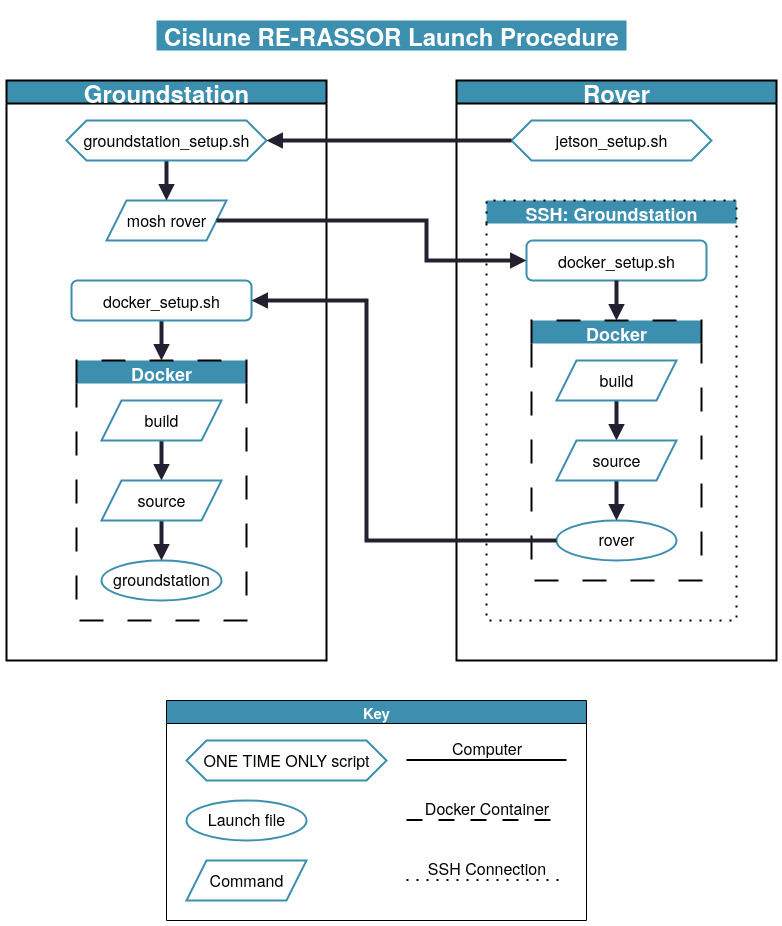

# Cislune RE-RASSOR

This repository contains the codebase for Cislune's version of the Florida Space Institute's RE-RASSOR project. The codebase is custom, as well as some of the 3D parts. Full credits will be listed in the credits section.

This codebase was developed by a Cislune intern working over the summer of 2025. It was meant to be practice for programming the larger rover, Nostromo, as well as the rover potentially being useful in contracts the company had. A complete list of learning outcomes that will be applied to Nostromo and future projects is listed at the end of the document.

- Software Stack
    - ROS2 (Jazzy)
    - ROS2 Control
    - Gazebo (Harmonic)
    - Nav2
    - SLAM Toolbox
    - Docker (Ubuntu Noble image)
    - PlatformIO
    - Mosh
- Hardware
    - Jetson Orin Nano Developer Kit
    - Teensy 4.1
    - Intel Realsense D455

- [Introduction](#introduction)
- [Installation and Setup](#installation-and-setup)
- [Rover Bringup](#rover-bringup)
- [Editing Guide](#editing-guide)
- [About the Project](#about-the-project)
- [Learning Outcomes](#learning-outcomes)
- [Credits](#credits)

## Introduction

**This code was only ever intended to run on Ubuntu based Linux distributions. There is no support for macOS or Windows.** However, because most of this will run in Docker, it is might be possible to translate the Linux setup commands into the corresponding commands for Windows or macOS. There was no way for me to test this, so I did not include it in the instructions.

This project was designed to run primarily in a Docker instance to help with consistency and portability. If you would like to learn more about docker, you can do so at [Docker Overview](https://docs.docker.com/get-started/docker-overview/). Specifically, this project uses Docker Engine with buildx for multi-architecture support. Installation details are listed in Installation and Setup. This docker setup is designed to work on both ARM64,x86-64, Nvidia GPU's, and not Nvidia GPU's.

Additionally, this project was designed with the assumption that the rover is using a Jetson Orin Nano as the onboard rover computer, a Teensy 4.1 as the microcontroller connected to the Jetson over USB, and a groundstation computer that remotely ssh's into the Jetson to run commands and view through Rviz2.

Most of the downloads and installations for necessary libraries will be handled inside the Dockerfile and compose files. There are a few things that need to be downloaded directly on the Jetson and on the groundstation computer. All of this setup has been configured in bash scripts included in the scripts/ folder of the repository, and the Installation and Setup section will instruct you on what scripts to run on what device. After all the installation and setup is done, you should only need to compose and connect the Docker container to develop and run the program. Bringup instructions, including all the different startup options, are explained in Rover Bringup.

This project was specifically designed to be modular. If you would like to edit this codebase for your own purposes and swap out some of the components, the guide to do so is in Editing Guide.

**If you are new to ROS2 projects and want to learn more**, I recommend two sources. Firstly, the beginning documentation for ROS2 is actually really good. It effectively teaches ROS2 concepts, though the quality does decrease as the complexity increases. You can find the ROS2 Jazzy documentation [here](https://docs.ros.org/en/jazzy/index.html). Secondly, I recommend using the official Nav2 documentation for everything else. It teaches concepts such as URDFs, transforms, and Gazebo. The official documentation for Gazebo is not very good and it is difficult to find updated tutorials, but Nav2 does a great job. You can find the official Nav2 documentation [here](https://docs.nav2.org/). [Articulated Robotics](https://articulatedrobotics.xyz/tutorials/) does a really good from scratch walkthrough as well, though it uses an outdated version of Gazebo that is not compatible with ROS2 Jazzy and up. It is difficult to find good tutorials for ROS2 Control that actually implement a Hardware Component, but you can find the official documentation [here](https://control.ros.org/master/doc/getting_started/getting_started.html). It does not have the best instructions so I recommend getting to this part last.

If you're curious about the background of the project, my learning outcomes as a student, or for the specific credits, those are all listed in the bottom sections.

## Installation and Setup

### Prerequisites
**Both the groundstation computer and the Jetson Orin Nano should be running Ubuntu 22.04 (Jammy Jellyfish) as their operating system.** While the Docker instance will be running Ubuntu 24.04 (Noble Numbat), there are compatibility issues between Nvidia's Jetpack SDK for Noble and Docker; the easiest solution is to downgrade the host computers.

Ensure that a recent version of [Git](https://git-scm.com/downloads/linux) and [VSCode](https://code.visualstudio.com/download) are downloaded.

Curl is also required for some of the scripts, ensure it is downloaded.

### First Time Setup

**Do not open VSCode before running the host system setup scripts.** This causes user permission issues with VSCode running Docker before the user is properly added to the usergroup. If you are running into permission issues when trying to start docker, first check to see if you are in the docker group by running `groups` in the host computer terminal. If you are and are still experiencing permission issues, close VSCode and run `killall code && newgrp docker` to end all VSCode services and refresh the docker group permissions. Reopen VSCode and it should work.

For a brand new Jetson Orin Nano, you must setup the Jetson with a mouse, keyboard, and external monitor. After it is flashed and running with Ubuntu 22.04, ensure everything is updated, and then clone this GitHub repository by running `git clone https://github.com/TheThingKnownAsKit/Cislune-RE-RASSOR.git`. Navigate into the repository and run the command `./scripts/jetson_setup.sh`. This should set up everything you need installed and configured locally, including the mosh server. Ensure that the Jetson is connected to the wifi network and will auotmatically connect to it when powered on. After this, you can disconnect the mouse, keyboard, and external monitor and should be able to access the Jetson remotely for any other development needed.

For a groundstation laptop that has never run this repository before, first ensure that the laptop is running Ubuntu 22.04 and that the system has been updated recently. After that, clone this GitHub repository by running `git clone https://github.com/TheThingKnownAsKit/Cislune-RE-RASSOR.git`. Navigate into the repository and run the command `./scripts/groundstation_setup.sh` which will download everything you need locally, configure settings, and set up the mosh client. Ensure that the groundstation computer is connected to the same wifi network as the Jetson.

For a computer that you plan on developing on, you can install some additional features to allow more functionality by running `./scripts/development_setup.sh` instead. This just downloads and configures a few extra things usually only downloaded onto the Jetson so that you can use more of the codebase from one computer. This does not setup any mosh services.

Unless you make changes to the scripts or reset a device, you should never need to run these scripts again.

### Launch Procedure

This section assumes that you have already ran the appropriate setup scripts for each device. It also assumes that the

1. On the groundstation computer, open a terminal and run the command `mosh rerassor@ubuntu.local`
2. In this mosh connection, ensure you are in the Cislune-RE-RASSOR repository, and run `./scripts/docker_setup.sh`
3. In this mosh connection, run the command `docker exec -it rerassor-rerassor_dev-1 bash` to open an interactive bash terminal inside the container
4. Inside this container terminal, make sure you are in the Cislune-RE-RASSOR repository level and run `source /opt/ros/jazzy/setup.bash`, then `colcon build --symlink-install`, and then `source install/setup.bash`
5. Run the command `ros2 launch rover_bringup rerassor.launch.py`
6. On the groundstation computer, open a new terminal and navigate into the Cislune-RE-RASSOR repository
7. Run the command `./scripts/docker_setup.sh` with the optional argument flags of `-r -c -v`.
    - `-r` will build the image with no cache
    - `-c` will recreate the containers even if no changes have been made since last compose
    - `-v` will open a VSCode instance attached to the container for you, but you can also just do this through the GUI by navigating to Containers (note you need Container Tools extension installed for this) -> Right click on docker-rerassor_dev -> Attach VSCode. You do not need to have VSCode open to do any of this setup, but in case you prefer to, you can execute this via the integrated terminal (you might need to run the one time setup script again to give VSCode proper permissions)
8. Run the command `docker exec -it rerassor-rerassor_dev-1 bash` to open an interactive bash terminal inside the container
9. From the Cislune-RE-RASSOR repository level, run the commands `colcon build --symlink-install` and then `source install/setup.bash`
10. Back inside the first terminal inside a docker container on the groundstation computer, run the launch command `ros2 launch rover_bringup groundstation.launch.py`

A visual diagram of this procedure is included below to help make sense of all the containers and connections going on.

## Editing Guide

For the most part, the only thing that you would need to edit to make this work for your own rover is edit some of the config files and replace the URDF. There may be some functionality missing that you would have to add in yourself, but otherwise the libraries handle most of the code.

This repository is split into ROS2 packages that are subfolders of rover_ros2. Any folder that begins with rover_ is a ROS2 package with its own package.xml and CMakeLists.txt. 

## Learning Outcomes

Skills learned:
1. Advanced ROS2
2. ROS2 Control
3. Gazebo
4. Nav2
5. SLAM Toolbox
6. Micro ROS (not currently used in project)
7. URDF and Xacro

Lessons learned:
1. 

## Credits

The original concept for the RE-RASSOR was developed by the Florida Space Institute as a modular and accessible solution for lunar rovers. The main page for this project can be found [here](https://floridaspacegrant.org/program/re-rassor/), which will include links to the GitHub Repository and 3D models.

A custom chassis and camera mount were modeled by Cislune for this project, but the rest of the models are from the RE-RASSOR team.

Reference files for the codebase were taken from the ROS2 Control team (credits given at the beginning of those files), and Articulated Robotics was an extremely helpful resource in learning all of these concepts.